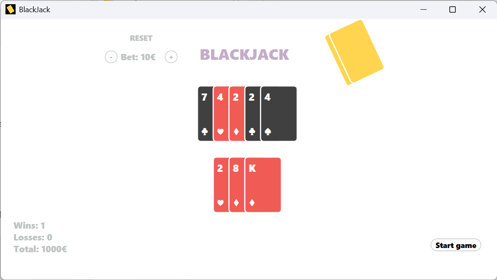

# Minimal BlackJack

Minimal BlackJack is a lightweight and visually minimalist implementation of the classic Blackjack card game, built using **WPF (Windows Presentation Foundation)**. The project focuses on clean design, intuitive gameplay, and a distraction-free user interface.



## 🎯 Features

- 🃏 Classic Blackjack rules

- 🎨 Minimalist and modern UI

- 🖱️ Mouse-based interaction

- 💡 Built with WPF and C#

- ⚡ Fast and responsive gameplay

## 🚀 Getting Started

### Running the Game

1. Clone the repository:

```bash

git clone https://github.com/Fabuloup/MinimalBlackJack.git

```

2. Open the solution in Visual Studio.
3. Build and run the project.

## 🧩 Gameplay

- The goal is to beat the dealer by getting a hand value as close to 21 as possible without going over.
- You can **Hit** to draw a card or **Stand** to end your turn.
- The dealer plays automatically according to standard Blackjack rules.

## 📸 Screenshot

